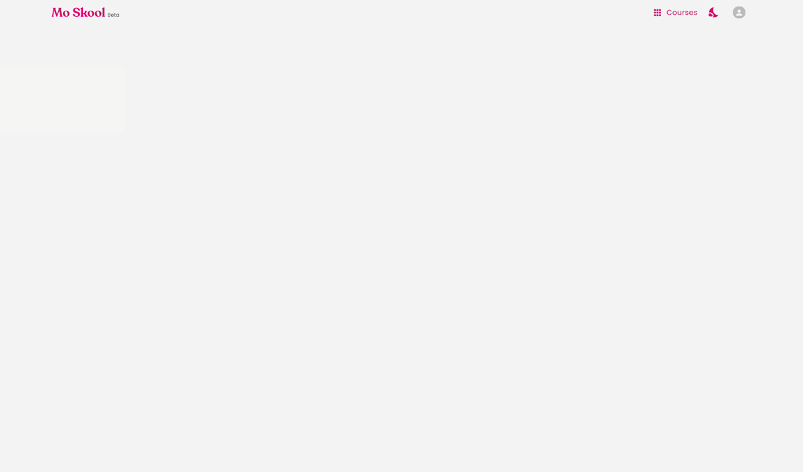

<!-- AUTO-GENERATED-CONTENT:START (STARTER) -->

  
  
  
  

<h1 align="center">
</h1>

⚠️ Note: This repo is for presentation purposes only, actual code is private atm ⚠️

## 💩 Tech powering Mo Skool

- **JAMstack** [JavaScript, APIs, and Markup](https://jamstack.org/)
  - Gatsby [Static site generator](https://www.gatsbyjs.com/docs/glossary/static-site-generator/)
  - GraphQL [used for SEO and querying data from firebase](https://www.gatsbyjs.com/docs/graphql/)
- **Front-end**

  - ReactJs (hooks, context api, global state, and higher order components)
  - Material UI [Component library, JSS styling and theming](https://material-ui.com/)
  - Jest unit and snapshot [testing and other testing libraries and dependencies](https://jestjs.io/)
  - Percy [visual and UI testing](https://percy.io/)
  - Husky and commitizen for sanity check
  - TypeScript, ESlint and Prettier

- **Back-end**

  - Google Cloud & Firebase [All your Backend needs](https://console.firebase.google.com)
  - Contentful [content storage and CDN](https://www.contentful.com/)

- **CI/CD**

  - Circle CI [build verify and deployments ](http://circleci.com/)
  - Netlify [Back up build verify and deployment](https://www.netlify.com/)

- **Other Tools**

  - Storybook [component library playground](https://storybook.js.org/)
  - Codacy [code quality check](https://www.codacy.com/)
  - Sentry [monitors front-end and log errors](https://sentry.io/)
  - snyk [monitors vulnerabilities in dependencies](https://snyk.io/)

Mo Skool built on sharing knowledge about modern React frontend development through fun and interactive questions. Experience a new visual way to learn and master frontend programming languages. Mo Skool's ultimate mission is to provide this learning opportunity for all ages around the world.

Sharing knowledge about React frontend development is what Mo Skool all about. Mo Skool makes learning React easy, curating important topics and segmenting courses by difficulty levels. Mo Skool delivers courses visually and interactively.

Best of all, Mo Skool is free to use, and I've built it to provide knowledge for all ages and levels. Expect to learn the following:

- HTML Basics and usage in React
- Styling components and elements in React
- Adding JavaScript functionality in React
- React Hooks, Context API, and Redux
- Best UI/UX practices

# Mo Skool MVP

- Coding editor with syntax highlighter and code beautifier
- Live preview renderer 
- Real-time Error console
- Easy to use author tools to speed up content creation and curation.
- Progress tracking and learning analysis 

# About Me 🐾

I was fortunate enough to move to this country when I was very young, and it was my dream to have the freedom to learn at my own pace. Reading articles and watching videos about React wasn't efficient for me. Practicing and writing code was the most effective way for me to learn React. I am developing Mo Skool to become an interactive tool to learn and share knowledge about React and frontend development. Best of all, I want this learning experience to be free and available for everyone to enjoy.

# Technology

Building Mo Skool with the future in mind, starting out as a web application but can be easily developed into a mobile app. 

- [Mo Skool Demo](https://moskool.com)
- Design: Custom library and Material UI
- Frontend: React, Gatsby and GraphQL
- Backend: Firebase

# Contribute 🏆

Feel free to send me PR if you would like to join me in building this awesome new platform 😍
<!-- AUTO-GENERATED-CONTENT:END -->

