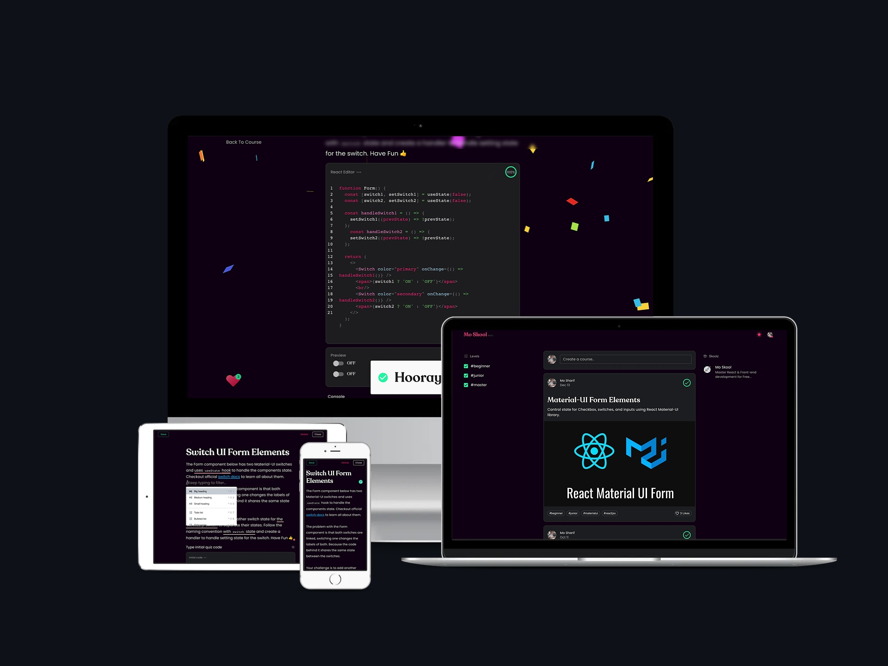

<!-- AUTO-GENERATED-CONTENT:START (STARTER) -->

  
  
  
  

<h1 align="center">
</h1>

## 🏆 Goals

- Mo Skool offers a self-guided learning experience for students and developers to master new front-end coding skills.
- Mo Skool also offers authors and teachers rich content and course creation tools, allowing authors to focus on course creation.

## 🚀 Features

- Super awesome Rich content editor, making course creation fun and easy.
- Live React code editor with a live preview built into each course, giving students the ability to learn to code interactively.
- Data and metrics collection about student's learning and skill development. 
- Learners can earn points and track their learning over time. Authors have similar analytic tools to track learning for their students.
- All courses and skools are SEO friendly.

⚠️ Note: This repo is for info purposes only. Actual code is private ⚠️

## 💩 Tech powering Mo Skool

- **JAMstack** [JavaScript, APIs, and Markup](https://jamstack.org/)
  - Gatsby [Static site generator](https://www.gatsbyjs.com/docs/glossary/static-site-generator/)
  - GraphQL [used for SEO and querying data from firebase](https://www.gatsbyjs.com/docs/graphql/)
- **Front-end**

  - ReactJs (hooks, context api, global state, and higher order components)
  - Material UI [Component library, JSS styling and theming](https://material-ui.com/)
  - Jest unit and snapshot [testing and other testing libraries and dependencies](https://jestjs.io/)
  - Percy [visual and UI testing](https://percy.io/)
  - Husky and commitizen for sanity check
  - TypeScript, ESlint and Prettier

- **Back-end**

  - Google Cloud & Firebase [All your Backend needs](https://console.firebase.google.com)
  - Contentful [content storage and CDN](https://www.contentful.com/)

- **CI/CD**

  - Circle CI [build verify and deployments ](http://circleci.com/)
  - Netlify [Back up build verify and deployment](https://www.netlify.com/)

- **Other Tools**

  - Storybook [component library playground](https://storybook.js.org/)
  - Codacy [code quality check](https://www.codacy.com/)
  - Sentry [monitors front-end and log errors](https://sentry.io/)
  - snyk [monitors vulnerabilities in dependencies](https://snyk.io/)

- [Learn more about Mo Skool's Top Features](https://moskool.com/about/)

<!-- AUTO-GENERATED-CONTENT:END -->

